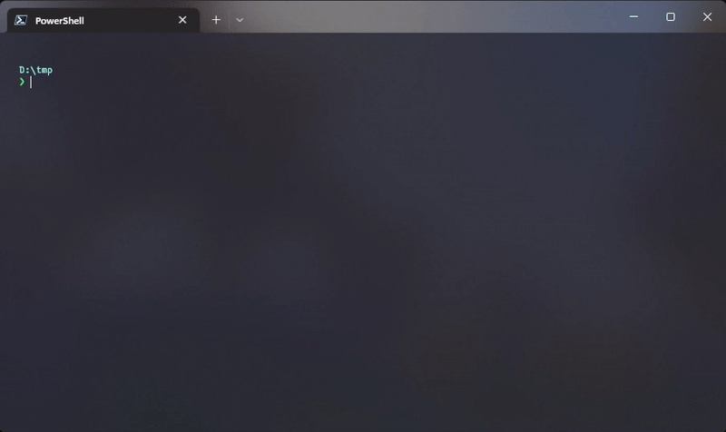

# FabricGen

FabricGen is a quick and dirty Minecraft Fabric mod generator in a CLI. It clones from the [fabric-example-mod repo](https://github.com/FabricMC/fabric-example-mod) and changes some files for you. Running the `genSources` and `runClient` commands work right out of the box!

## Installation
### Windows
- Just download the exe from the Github releases, or you can run `cargo install fabricgen`.
### MacOS / Unix
- Install Rust and run `cargo install fabricgen`. Make sure that you have a C compiler installed (GCC or Clang).

## Plans for 0.2:
- Support for Kotlin
- Create mods for 1.15 and 1.14
